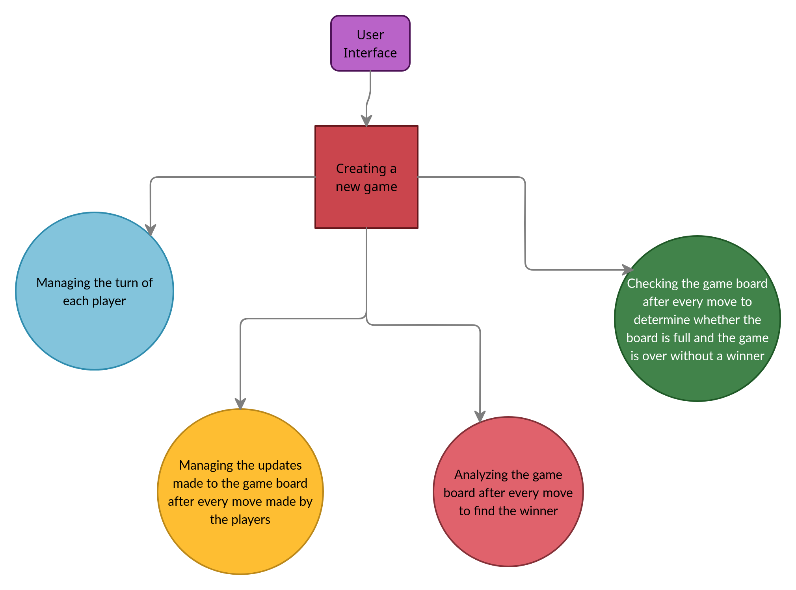

# Requirements
## Introduction
 Recreation is something that humans have sought from time immemorial, as the saying goes, "All work and no play makes Jack a dull boy". 
 
 >Connect 4 is a very popular board game in which the players first choose a color and then take turns dropping colored discs from the top into a seven-column, six-row vertically suspended grid. The pieces fall straight down, occupying the next available space within the column. The objective of the game is to be the first to form a horizontal, vertical, or diagonal line of four of one's own discs. -- Wikipedia

Here, this popular board game has been recreated digitally.

## Research

- This game was first sold under the Connect 4 trademark by Milton Bradley in 1974
- Connect 4 is a perfect information, zero sum game that was first solved by James Dow Allen (1 October, 1988) and independently by Victor Allis (16 October, 1988)
- The solution shows that Connect 4 is a first player win game.
- There have been many variations on Connect 4 that include changing the board size (traditionally 6x7) and game rules. Some variations of the game are listed below
    - Infinite Connect-four
    - Cylinder Infinite Connect-four
    - Hasbro's connect 4
    - Pop Out
    - Pop 10
    - 5-in-aRow
    - Power-Up

## Cost and Features

- Resources used include a 64-bit computer and memory

## Defining Our System
    
- The system has a user interface which allows the players to start a new game
- Once started, the game is managed by the computer which takes care of storing the players' move's, discarding illegal moves, analysing the board after each move to find the winning move, and terminating the game if there are no moves left.

The high level system design is shown in the figure below

## SWOT ANALYSIS

# 4W&#39;s and 1&#39;H

## Who:

For all people who want to play the game with another person, but currently don't have access to the physical components.

## What:

To recreate a popular physical game in a digital version so that people can enjoy playing it, without the hassle of searching for the required physical equipment.

## When:

Can be played anytime

## Where:

Can be played anywhere, ease of use

## How:

Played on a system, using a computer

# Detail requirements

## High Level Requirements:

ID | Description | Status (Implemented/Future)
---|-------------|----------------------------
HL01 | User Interface | Implemented
HL02 | Creating a new game | Implemented
HL03 | Managing the game played between two players | Implemented

##  Low level Requirements:

ID | Description | Status (Implemented/Future)
---|-------------|-----------------------------
01 | Menu which asks the user if they want to play a new game or leave | Implemented
02 | Initialising a new game if the user chooses to play | Implemented
03 | Choosing the first player using a random function | Implemented
04 | Allowing each player to perform their moves | Implemented
05 | Analysing the moves performed to find illegal moves | Implemented
06 | Analysing the board after evry move to find if a winning move has been made in which the game is over after the winner is declared| Implemented
07 | Analysing the board after every move to determine if the board is full and the game is over | Implemented
08 | A function that prints the contents of the board after each move so that players have information to make their next move | Implemented
09 | A variable to keep track of the current player, so that each player's is able to play their turn | Implemented